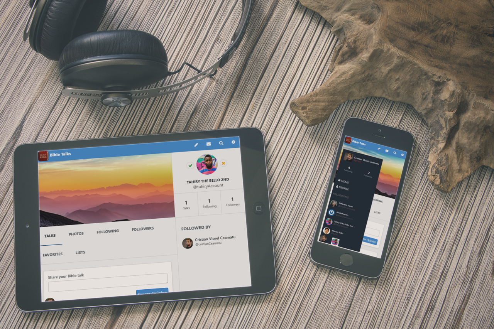
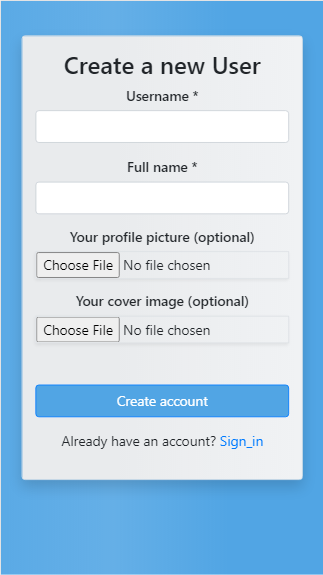
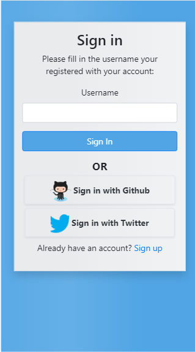

  

# Bible Talks social web app built in rails with user registration and creation of talks(tweets)/follow/unfollow users.

> In this project, we were required to build a social app where users can sign-up/sign-in/sign out, create talks(tweets), and follow/unfollow other users. The project enforced our skills in using most of the core functionalities of the Rails framework.
 
> The app is mobile responsive and users can <b>sign up/sign in with their Github and Twitter accounts</b>. Users can upload a profile and cover images at the sign-up or after they sign in by accessing the profile page, here they can also edit their username and full name.
 
> The app is tested using RSpec for unit and integration tests

## App functionality

- Users can sign up/sign in/sign out by filling out the forms or using their Github or Twitter account
- Users can create talks (tweets)
- Users can upload a profile and cover images when they sign up, otherwise they will have default placeholders
- Users can edit their profile username, full name and images
- Users can follow and unfollow other users
- Users can see who he is following and who are following other users
- The app is fully mobile responsive

## Video presentation of the project [here](https://www.loom.com/share/b40e1d7bda964f3d930f232d4bebfafd)

## This web app is live, you can check it here: [Live demo](https://rails-bible-talks.herokuapp.com/)

## Screenshots of the app.

 

## Built With

- Ruby
- Rails
- RSpec
- PostgreSQL
- Omniauth
- Bootstrap
- Fontawesome

## Prerequisities

To get this project up and running locally, you must have ruby and postgres installed on your computer.

## Getting Started

**To get this project set up on your local machine, follow these simple steps:**

**Step 1** 
Navigate through the local folder where you want to clone the repository and run 
`git@github.com:cristianCeamatu/rails-bible-talks-social-app.git`. It will clone the repo to your local folder. 
or with https 
`https://github.com/cristianCeamatu/rails-bible-talks-social-app`. 
**Step 2** 
Run `cd rails-bible-talks-social-app` 
**Step 3** 
Run `bundle install` to install the gems from the `Gemfile`. 
**Step 4** 
Run `yarn install` to install the npm packages from the `package.json` file. 
**Step 5** 
Run `bundle exec figaro install`, this will create a file called `application.yml` in the `config` folder. 
**Step 6** 
Open `config/application.yml` and add your credenatials for your postgres/[github](https://github.com/settings/applications) and [twitter](https://dev.twitter.com/apps) accounts like this (click on the above links to find out how to get a key): 
`PG_DATABASE_USER: example`  
`PG_DATABASE_PASSWORD: password` 
`GITHUB_KEY: key` 
`GITHUB_SECRET: key` 
`TWITTER_KEY: key` 
`TWITTER_SECRET: key` 
**Step 7** 
Run `rails db:create` and `rails db:migrate` to create and migrate the database tabels and associations. 
**Step 8** 
Run `rails s` to start the rails server. 
**Step 9** 
You can visit the app at `http://localhost:3000`. Enjoy! 

## Tests

1. Open Terminal

2. Migrate the test database:

   `rails db:migrate RAILS_ENV=test`

3. Run the tests with the command:

   `rspec`

## Authors

👤 **Cristian Viorel Ceamatu**

- Github: [@cristianCeamatu](https://github.com/cristianCeamatu)
- Twitter: [@CeamatuV](https://twitter.com/CeamatuV)
- Linkedin: [Ceamatu Cristian](https://www.linkedin.com/in/ceamatu-cristian/)

## 🤝 Contributing

Our favourite contributions are those that help us improve the project, whether with a contribution, an issue, or a feature request!

## Show your support

If you've read this far....give us a ⭐️!

## 📝 License

This project is licensed by Microverse and the Odin Project

##  Acknowledgement

- Design idea by [Gregoire Vella on Behance](https://www.behance.net/gregoirevella)